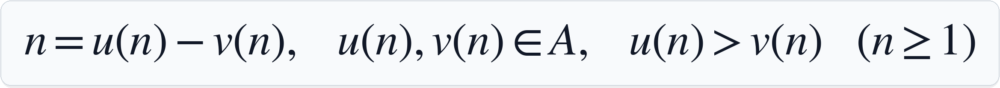
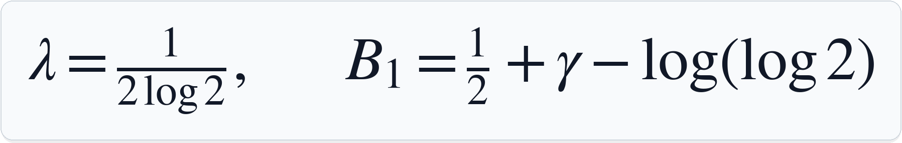
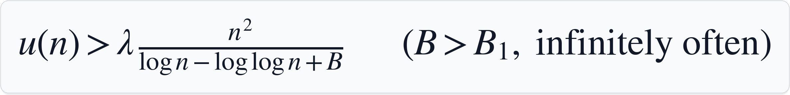
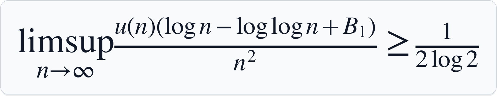

# A Lean Formalization of the Floor-Saving Lower Bound for Erdos Problem #1194

This repository contains a Lean 4/mathlib proof of a logarithmic lower bound in
the infinite perfect difference set problem. The Lean statement is the public
entry point; the explanatory notes are secondary.

Let `A` be a set of positive integers such that every `n >= 1` has exactly one
ordered representation:

<p align="center">
   v(n), for n >= 1" width="900">
</p>

The main result proves that, with

<p align="center">
  
</p>

for every fixed `B > B_1` there are arbitrarily large `n` such that

<p align="center">
   lambda n^2 divided by log n minus log log n plus B, for B greater than B_1, infinitely often" width="900">
</p>

It also proves the endpoint limsup consequence

<p align="center">
  
</p>

The endpoint statement is a limsup consequence only; it does not assert the
pointwise infinitely-often inequality at `B = B_1`.

## Trusted Statement

Read [`Challenge.lean`](Challenge.lean) first. It imports only `Mathlib`, defines
the vocabulary used in the statements, and contains the two theorem statements
that comparator checks:

- `FloorSaving.floor_saving_lower_bound`
- `FloorSaving.endpoint_limsup`

[`Solution.lean`](Solution.lean) imports the proved `FloorSaving` library for
comparison against the challenge statements.

## Proof Layout

The main theorem is proved in
[`FloorSaving/MainSkeleton.lean`](FloorSaving/MainSkeleton.lean). The endpoint
limsup consequence is proved in
[`FloorSaving/EndpointLimsup.lean`](FloorSaving/EndpointLimsup.lean).

The top-level module [`FloorSaving.lean`](FloorSaving.lean) imports the full
proof.

## Checking

This project uses Lean `4.30.0-rc2` and mathlib, pinned by:

- [`lean-toolchain`](lean-toolchain)
- [`lakefile.toml`](lakefile.toml)
- [`lake-manifest.json`](lake-manifest.json)

To check the Lean proof:

```bash
lake exe cache get
lake build FloorSaving
tools/check_no_sorry.sh
```

`Challenge.lean` intentionally has statement placeholders for comparator. The
no-sorry check is scoped to the proof library.

For an independent statement/proof comparison, use
[`comparator.json`](comparator.json):

```bash
lake env comparator comparator.json
```

This requires `landrun`, `lean4export`, and `comparator` on `PATH`, with
versions compatible with Lean `v4.30.0-rc2`. See [`AUDIT.md`](AUDIT.md) for the
audit workflow.

## Explanatory Notes

- [Proof sketch (PDF)](docs/reference/floor_saving_proof_sketch.pdf)
- [Proof sketch (TeX)](docs/reference/floor_saving_proof_sketch.tex)
- [Detailed notes (PDF)](docs/reference/floor_saving_lower_bound_final_version.pdf)
- [Detailed notes (TeX)](docs/reference/floor_saving_lower_bound_final_version.tex)
- [Equation index](docs/reference/EQUATION_INDEX.md)

## Notes

Generative AI tools assisted with development and drafting. The proof artifact
is the Lean code checked by Lake and, for statement matching, comparator.
